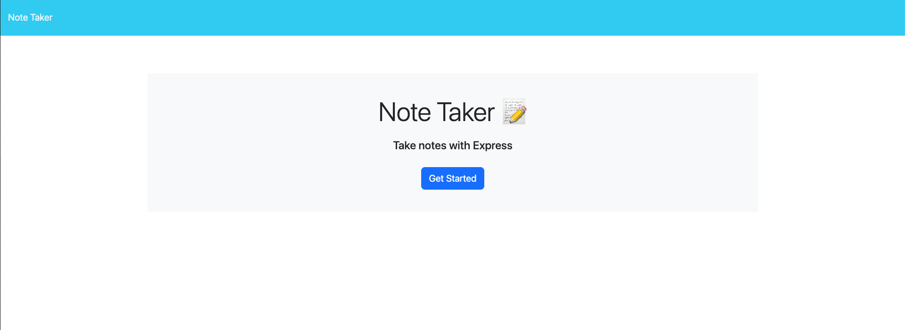

# <NoteTaker>

## Description

This is an app built from existing front-end code in which I practiced creting servers with modularized routing for the first time. It allows a user to maksave notes and see them persisting whenever they load them. This gave me increased practice in Node.js and servers in general, as well as GET, POST, and DELETE requests.

## Installation

No steps required, just visit site and use! Hooray.

## Usage

Navigate to site [here](https://notetaker-edx-112358.herokuapp.com/notes). Click get started, and you'll be able to see your notes and add new ones. Delete functionality freshly added.

## Credits

None beyond the curriculum team that created the starter code!